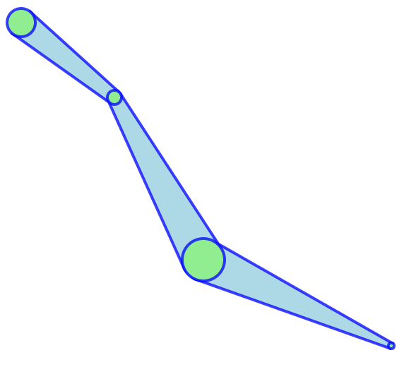
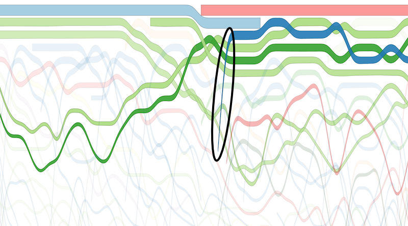
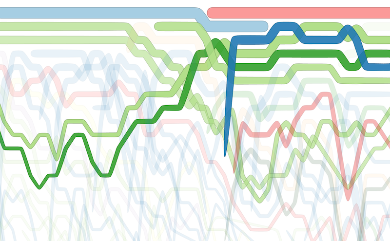

# d3-streamline

An update to [d3.svg.ribbon](https://github.com/emeeks/d3.svg.ribbon) as a D3 v4+ module/plugin.
Designed to interpolate ribbon or band areas based on sample points with radii.

[Interactive example](http://bl.ocks.org/emeeks/a1e48992be56681e3f93)

Thicknesses get attenuated creating bump charts with d3.area. If they jump between ranks too significantly, it makes the corresponding graphical transition look too thin. Like the circled blue area, which is rendered significantly thinner than if it was being drawn horizontally.

In contrast, the same bump chart using d3-streamline does not create these attenuation artifacts.

## Installing

If you use NPM, `npm install d3-streamline`. Otherwise, download the [latest release](https://github.com/gordongli/d3-streamline/releases/latest).

## API Reference

<a name="streamline_x" href="#streamline_x">#</a> <i>streamline</i>.<b>x</b>(<i>[x]</i>)

The x-accessor for the points array, just like d3.line and d3.area. Defaults to returning d.x.

<a name="streamline_y" href="#streamline_y">#</a> <i>streamline</i>.<b>y</b>(<i>[y]</i>)

The y-accessor for the points array, just like d3.line and d3.area. Defaults to returning d.y.

<a name="streamline_r" href="#streamline_r">#</a> <i>streamline</i>.<b>r</b>(<i>[r]</i>)

The radius accessor for the points array. This determines the thickness of the stream at that point. Defaults to returning d.r.

<a name="streamline_curve" href="#streamline_curve">#</a> <i>streamline</i>.<b>curve</b>(<i>[curve]</i>)

The D3 curve interpolator method to use. Default is d3.curveLinearClosed.